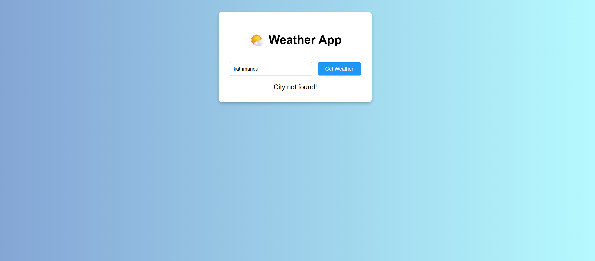

# 🌤️ Weather App

This is a simple weather app built using HTML, CSS, and JavaScript. It fetches live weather data for any city using the OpenWeatherMap API.

## 🔧 Technologies Used:
- HTML
- CSS
- JavaScript
- OpenWeatherMap API

## 📦 Features:
- Search any city
- Displays temperature, weather description, and country
- Simple, responsive design

## 🔗 Live Demo
*(Add GitHub Pages link here if hosted)*

## 📸 Screenshot

## 🛠️ How to Use:
1. Replace `YOUR_API_KEY` in `script.js` with your own key from [OpenWeatherMap](https://openweathermap.org/api)
2. Open `index.html` in a browser and test it

---

👨‍💻 Developed by Dipesh Pokhrel (LETxworld)

